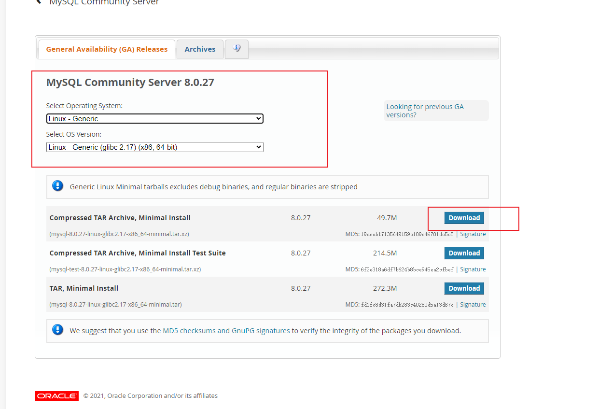
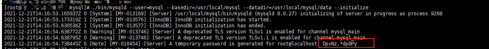

# L@kWz%4@Vt$vysFFcetos安装mysql8
安装包地址： https://dev.mysql.com/downloads/mysql/



1. 点击进去之后，下载好包传到服务器，或者直接在服务器下载包：

   ``````
   wget https://cdn.mysql.com//Downloads/MySQL-8.0/mysql-8.0.29-linux-glibc2.17-x86_64-minimal.tar.xz
   ``````

2. 将压缩包解压到 `usr/local` 路径里面，命令:   

  `````
  cd /usr/local/
  tar -xvf mysql-8.0.29-linux-glibc2.17-x86_64-minimal.tar.xz
  `````

3. 修改目录名称： 

   ````
   mv mysql-8.0.29-linux-glibc2.17-x86_64-minimal mysql
   ````

4. 创建mysql用户:

  ```
  groupadd mysql
  useradd -g mysql mysql
  ```

5. 切换到mysql根目录下 cd /usr/local/mysql，并创建data文件夹:

  ````
   cd /usr/local/mysql
   mkdir data
  ````

6. 授权mysql用户文件夹访问权限：

  ````
  chown -R mysql:mysql /usr/local/mysql
  ````

7. 切换到/usr/local/mysql/bin目录下，初始化mysql:

  ````
  ./mysqld --user=mysql --basedir=/usr/local/mysql --datadir=/usr/local/mysql/data --initialize
  ````


	得到初始密码，先记录下密码：DpvNz,\*dp8Py，等下用到

8. 编辑mysql配置文件 `vim /etc/my.cnf`，并修改对应basedir、datadir、socket、log-error、pid-file为如下内容：

```Plain Text
[mysqld]
#如果mysql安装目录不是/usr/local/mysql，则必须加上basedir这个配置：basedir=/xxx/xxx/mysql
basedir=/usr/local/mysql
datadir=/usr/local/mysql/data
socket=/tmp/mysql.sock
max_connections=1000
[client]
socket=/tmp/mysql.sock
[mysqld_safe]
log-error=/usr/local/mysql/data/mariadb.log
pid-file=/usr/local/mysql/data/mariadb.pid
```
9. 把mysqld服务拷贝到系统：

  ```
  cp -a /usr/local/mysql/support-files/mysql.server /etc/init.d/mysql
  授权并设置开启自启动：
  chmod +x /etc/init.d/mysql
  chkconfig --add mysql
  ```

  

10. 启动mysql服务

    ````
    service mysql start
    ````

11. 设置mysql软链接：

    ````
    ln -s /usr/local/mysql/bin/mysql /usr/bin/mysql
    ````

12. 登录mysql：

    ```
    mysql -uroot -p
    ```

    输入刚才初始化生成的临时密码：例：DpvNz,\*dp8Py
    如果这里报这个错`mysql: error while loading shared libraries: libncurses.so.5: cannot open shared object file: No such file or directory` ，解决方法：

    ```
    yum install libncurses*
    ```

    

13. 安装完成之后，需要立即修改mysql密码，否则执行任何指令都会提示：

    ```
    No connection. Trying to reconnect...
    Enter password: 
    Connection id:    11
    Current database: *** NONE ***
    
    ERROR 1820 (HY000): You must reset your password using ALTER USER statement before executing this statement.
    ```

    修改密码：

```Plain Text
ALTER USER 'root'@'localhost' IDENTIFIED BY 'FOGm4coGsyKqIEBH' PASSWORD EXPIRE NEVER;
flush privileges;

```
### 
mysql安装完成
