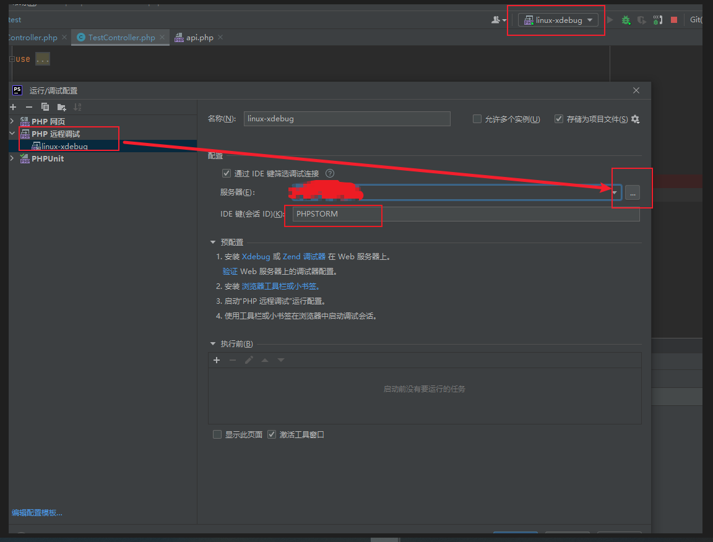
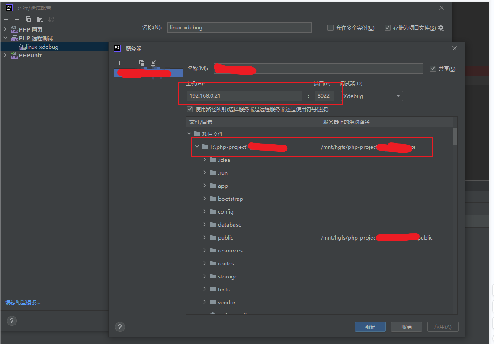
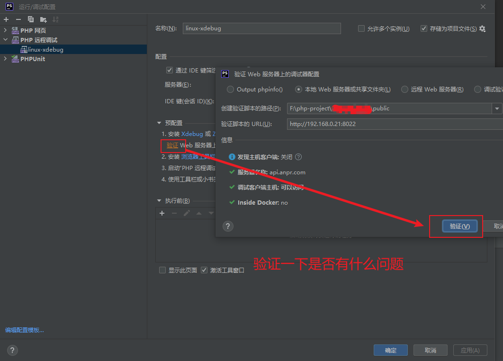
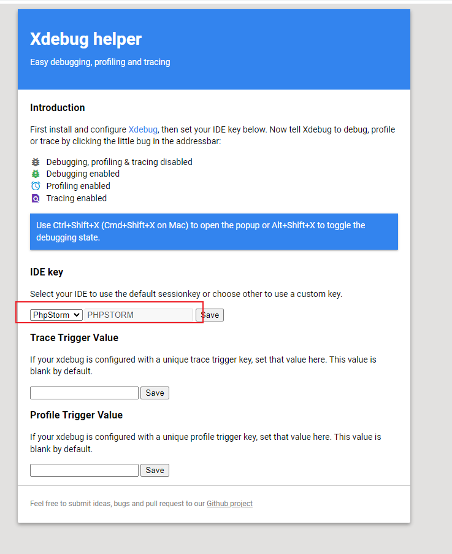
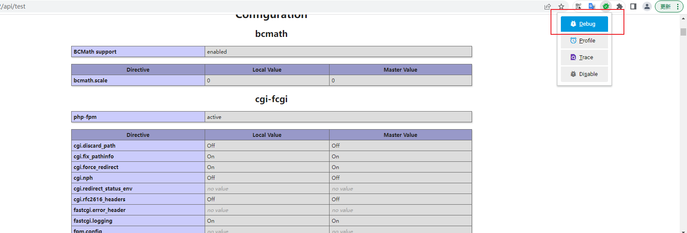
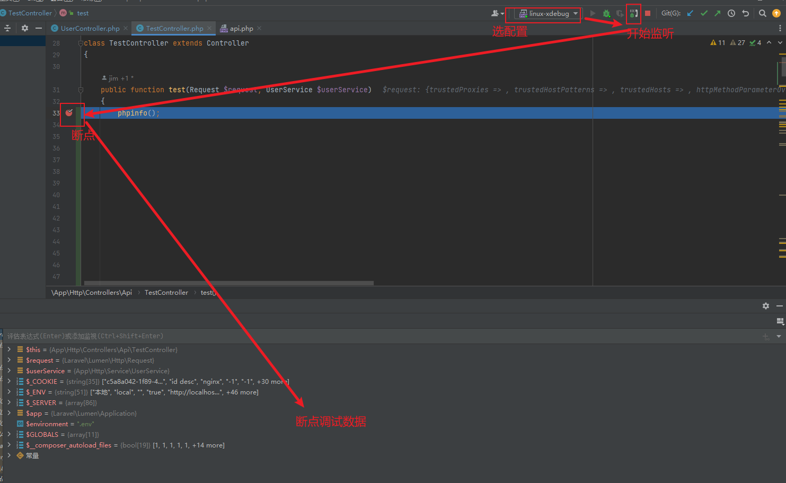

1.php安装xdebug扩展，这里以xdebug3的版本为例
2.配置php.ini

```
[xdebug]
zend_extension=/www/server/php/80/lib/php/extensions/no-debug-non-zts-20200930/xdebug.so

xdebug.mode=debug

xdebug.client_port=9001 //PHPSTORM监听的端口

xdebug.client_host=192.168.0.20 //远程服务器，如果是本地调试则填写127.0.0.1

xdebug.remote_log=/www/server/php/80/var/log/php-xdebug.log

xdebug.idekey="PHPSTORM"
```

3.配置PHPSTORM










在浏览器安装 Xdebug helper 调试插件，安装好之后配置如下




浏览器访问网址，选中debug




phpstorm打断点，然后就可以调试了



